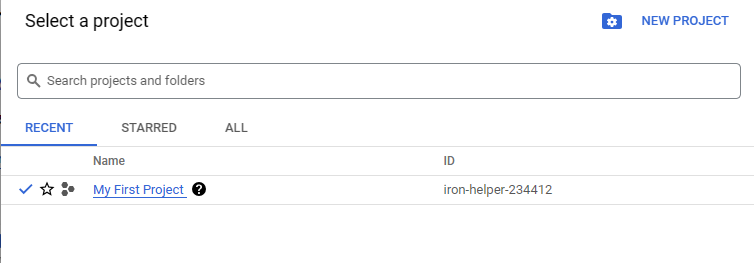

# Setting Up Google Cloud

First of all, you need to install [Google Cloud CLI](https://cloud.google.com/sdk/docs/install)

If you are using Ubuntu, you can invoke the following commands:

```bash
sudo apt-get update
sudo apt-get install apt-transport-https ca-certificates gnupg curl sudo
echo "deb [signed-by=/usr/share/keyrings/cloud.google.asc] https://packages.cloud.google.com/apt cloud-sdk main" | sudo tee -a /etc/apt/sources.list.d/google-cloud-sdk.list
curl https://packages.cloud.google.com/apt/doc/apt-key.gpg | sudo apt-key --keyring /usr/share/keyrings/cloud.google.gpg add -
sudo apt-get update && sudo apt-get install google-cloud-cli
```

Once you have installed Google Cloud CLI, you need to login

```bash
gcloud auth login
Your browser has been opened to visit:

    https://accounts.google.com/o/oauth2/auth?response_type=xxx


You are now logged in as [xxx@gmail.com].
Your current project is [None].  You can change this setting by running:
  $ gcloud config set project PROJECT_ID
```

Gcloud will ask you to set the project id. You can get the Project Id by accessing your [project page](https://console.cloud.google.com/)



```bash
gcloud config set project xxx-xxx-xxx
```