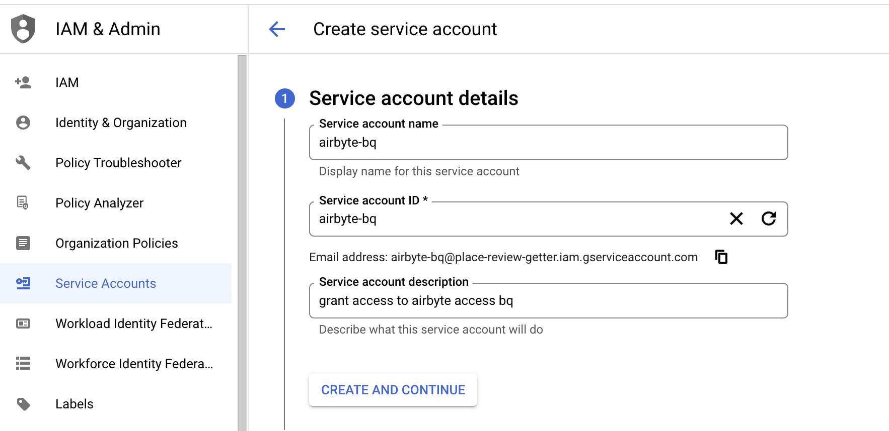
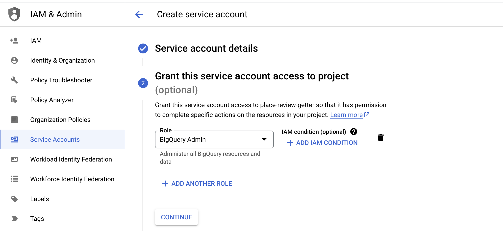
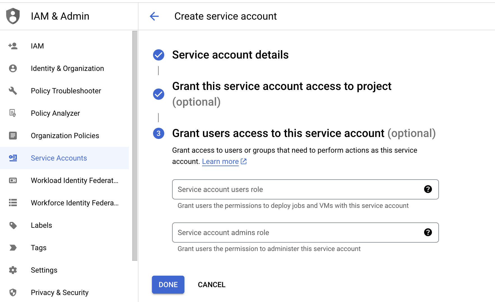
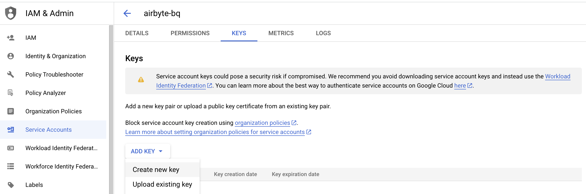
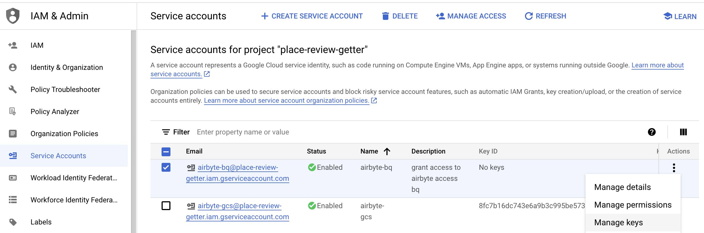
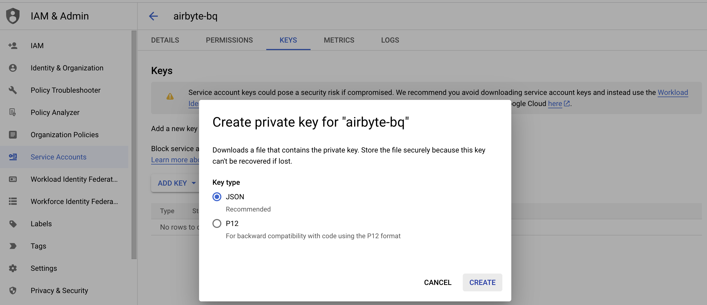
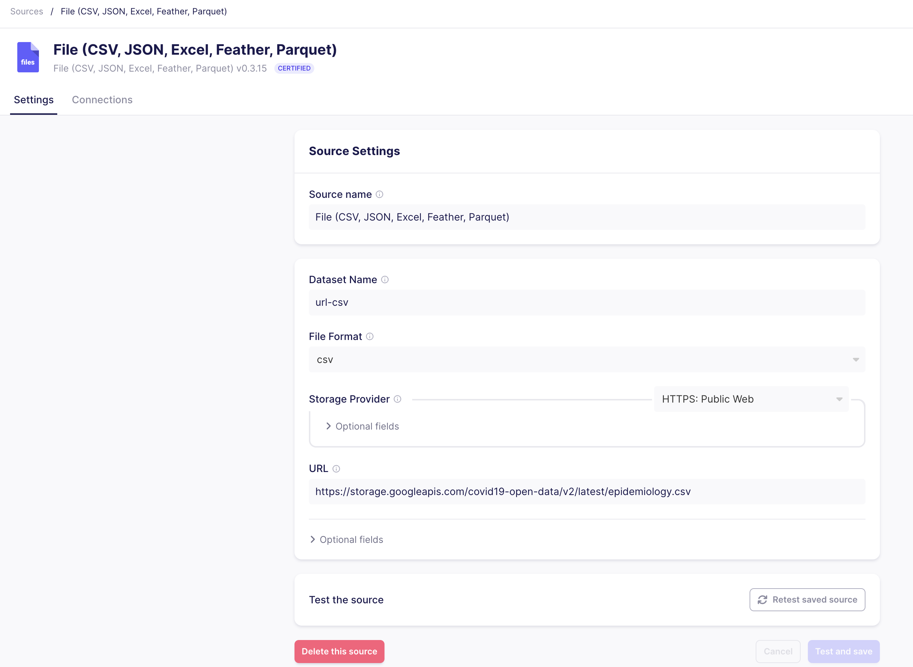
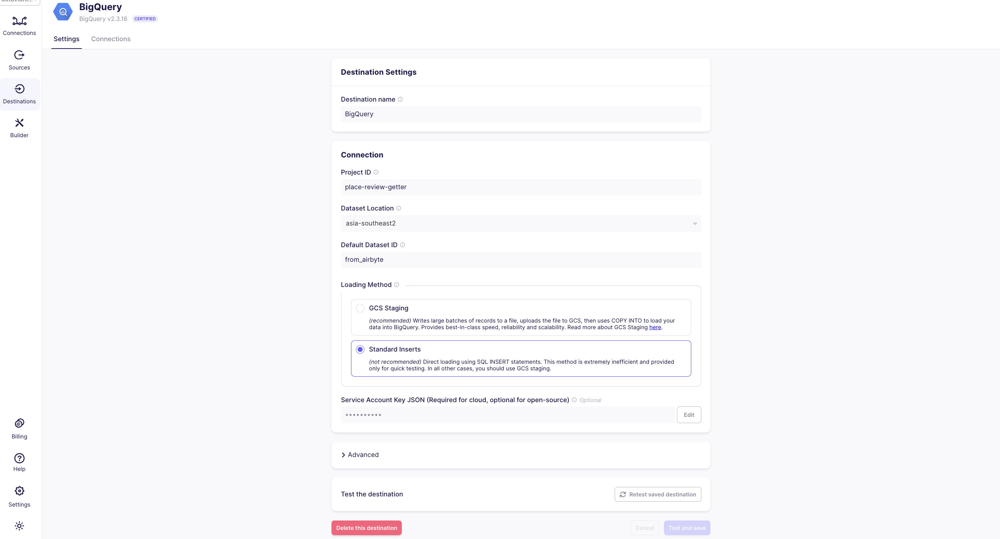
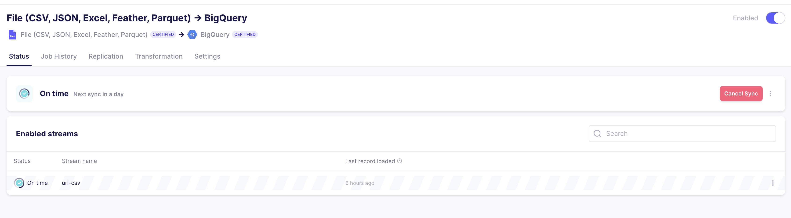

# [Day-2] Load Data to BigQuery via Airbyte

## Run Airbyte via Docker

- Execute the command below to run airbyte server via [docker-compose](https://github.com/Immersive-DataEngineer-Resource/ingestion-data/tree/main/ingestion_airbyte) or download the airbyte docker-compose from the [documentation](https://docs.airbyte.com/quickstart/deploy-airbyte). 

- This `sh` file will setup airbyte installation, download its dependencies and make sure the airbyte is running.

```
./run-ab-platform.sh
```

- Once all the installation is complete, open the browser, go to airbyte dashboard in http://localhost:8000 and login with this credential.
```
username: airbyte
password: password
```

- We are going to load Corona data from this [url](https://storage.googleapis.com/covid19-open-data/v2/latest/epidemiology.csv) to BigQuery dataset via airbyte. 

## Create Service Account on GCP 

















## Create Source in Airbyte




## Create Destination in Airbyte

- To create connection, supply the Project ID, Dataset Location and Dataset ID from GCP to the Destination dashboard.

- Also, we should copy service-account.json key and paste it to the required textbox.




## Sync Data from Airbyte Source to Destination


